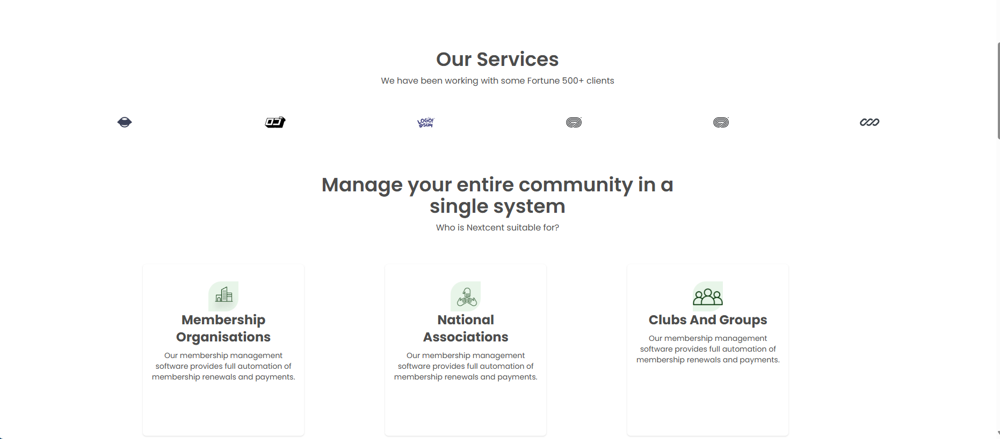
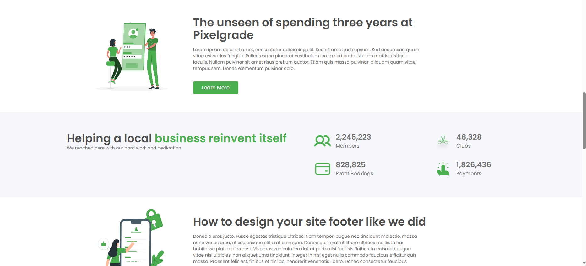
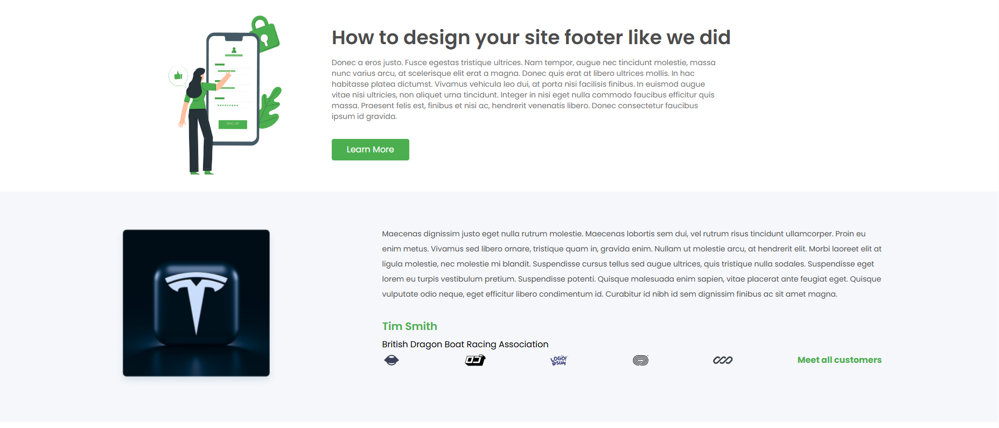
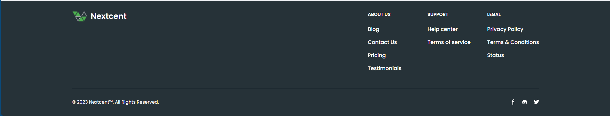

# React + Vite👻

This template provides a minimal setup to get React working in Vite with HMR and some ESLint rules.

Currently, two official plugins are available:

- [@vitejs/plugin-react](https://github.com/vitejs/vite-plugin-react/blob/main/packages/plugin-react/README.md) uses [Babel](https://babeljs.io/) for Fast Refresh
- [@vitejs/plugin-react-swc](https://github.com/vitejs/vite-plugin-react-swc) uses [SWC](https://swc.rs/) for Fast Refresh

## Run Project 🤗

`npm install`
`npm run dev`

## Package Use In Project 🌱

- Reactjs
- Tailwind
- Flowbite React
- React Icons
- React Scroll

# Image Preview 👾

## Special Thanks Author ✨

- [Bùi Quốc Huy](https://github.com/buiquochuy2k1) for making the amazing site for this repo!
